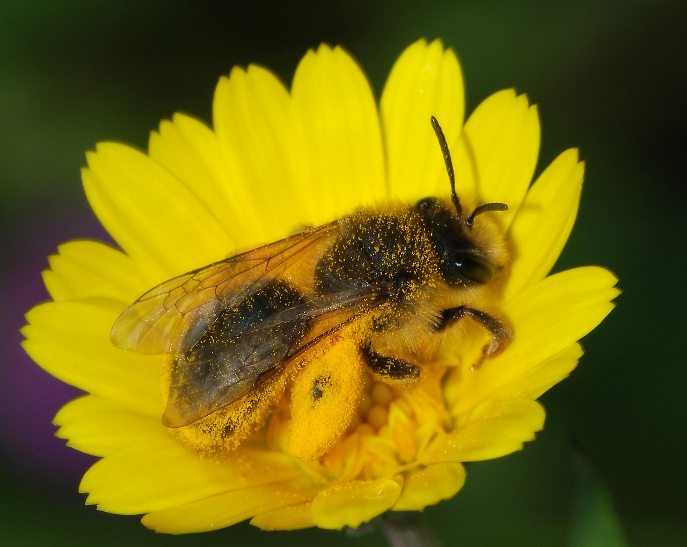
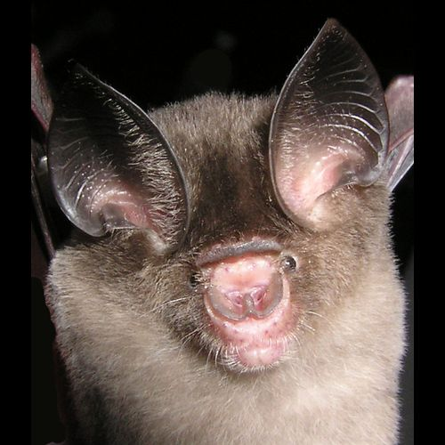
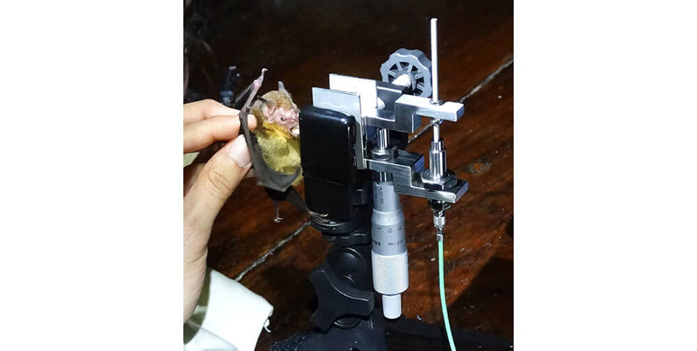

```{r setup, include=FALSE}

#Install packages
library(ggplot2)
library(arm)
library(ggfortify)
library(AICcmodavg)
library(grid)
library(ggplot2)
library(plyr)
library(arm)
library(MASS)
library(ggfortify)
library(gridExtra)
```


I will begin with an example of a binary generalized linear model using data published by Kuhlman et al. (2021). This study measured bee *Andrena spp.* presence and absence related to flower richness. Surveys were taken from 2015-2016. A total of 51 bees were surveyed and 122 species of flowers were documented.

One goal of this study was to determine whether there was a relationship between flower richness and the presence or absence of bees, in hopes of understanding patterns in the bee community in Logan, Utah.

In my model, flower richness is the predictor variable and bee presence or absence is the response variable. If there is a relationship between the two variables, it would be flower richness affecting bee occurrence, not the presence of bees affecting the richness.

Because there are growing concerns about declining bee populations, another goal would be to find an equation that would predict the probability of a bee population surviving on a landscape with a particular flower richness to help determine which landscapes to introduce bees to.  

```{r import data}
#Make sure to select working directory
library(readr)
bees <- read_csv("bee_data.csv")
bees[!duplicated(bees), ]
```

```{r plot, message=FALSE, warning=FALSE}
ggplot(bees, aes(Flower_Richness, pres)) +
  geom_point(size=3) +
  geom_smooth(method="glm", method.args=list(family="binomial"(link="logit"))) +
  labs(title="GLM, binomial count (1=presence/0=absence)") +
  ylab ("Probability of Occurence") +
  xlab ("Flower Richness")
```
```{r model_grainsize}
model_bees <- glm(pres ~ Flower_Richness, data=bees, family=binomial)
model_bees
```

```{r check for overdispersion}
library(arm)
x <- predict(model_bees)
y <- resid(model_bees)
binnedplot(x, y)
```

```{r bee model coefficients}
coef(model_bees)
```

```{r bee model confidence intervals}
confint(model_bees)
```

Now I want to interpret the slope of the logistic regression. Dividing the slope coefficient by four will give us an approximate estimate for the maximum predicted effect on the response of a unit change in the predictor. Slope of flower richness variable is 1.3.
\
\
In this case, a difference in 1 flower species corresponds to a increase in the probability of occurrence by 32.5% since 1.3/4 = 0.325. (*100 to convert to percent= 32.5%).   

```{r model summary}
summary(model_bees)
```




I will now show an example of a generalized linear model using data published by Senawi et al. (2015). 

This study examined the correlation between morphological variation and bite force of 35 species of insectivorous bats in Pahang, Malaysia. Bite force was measured by using a bite force transducer setup (pictured below). This device is able to register the force produced by a bat as it bites voluntarily; it converts the pull produced by the bite, applied on a tape-covered metal plate, into an electrical impulse that is read by a force amplifier.



1.	Is there a relationship between head length and maximum bite force (N) in bats? 

2.	Does sex modify the relationship between head length and bite force (N) in bats?

3.	Is bite force different after accounting for both head length AND sex? (hint: use library(emmeans) for pairwise comparisons of covariate-adjusted means)

```{r message=FALSE, warning=FALSE}
library(readr)
library(emmeans)
bats <- read_csv("bite.force.csv")
View(bats)

bats.poisson <- glm(MaxBF.N ~ Head.length, family= poisson(link=log), data= bats)

bats.gauss <- glm(MaxBF.N ~ Head.length, family= gaussian(link=identity), data= bats)

#sprint.gamma <- glm(Max_2m~HLL, family=Gamma(link= "sqrt"), data= lizard_sprint)
anova(bats.poisson, bats.gauss, test = "Chisq")
```


```{r message=FALSE, warning=FALSE, fig.height=6, fig.width=6}
bats1 <- ggplot(bats,aes(Head.length, MaxBF.N))+geom_point() +
  geom_smooth(method="glm",colour="red",
                         method.args=list(family="poisson"(link="log")))+
  labs(title="GLM, log link, Poisson variance")

bats2 <- ggplot(bats,aes(Head.length, MaxBF.N))+geom_point() +
  geom_smooth(method="glm",colour="red",
                         method.args=list(family="gaussian"(link="identity")))+
  labs(title="GLM, identity link, Gaussian variance")

#p3 <-ggplot(lizard_sprint,aes(HLL,Max_2m))+geom_point() +
  #geom_smooth(method="glm",colour="red",
                         #method.args=list(family="Gamma"(link="sqrt")))+
  #labs(title="GLM, square-root link, Gamma variance")

grid.arrange(bats1, bats2, ncol=1)
```

```{r message=FALSE, warning=FALSE}
bats1+geom_point(aes(colour = factor(Sex)))
```

```{r message=FALSE, warning=FALSE}
bats.poisson.sex <- glm(MaxBF.N ~ Head.length + factor(Sex), family= poisson(link=log), data= bats)
anova(bats.poisson.sex)
summary(bats.poisson.sex)
```